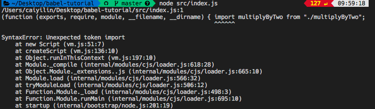
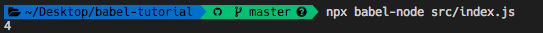
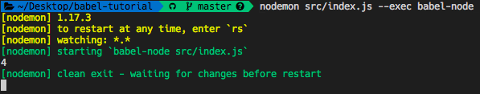
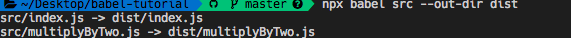
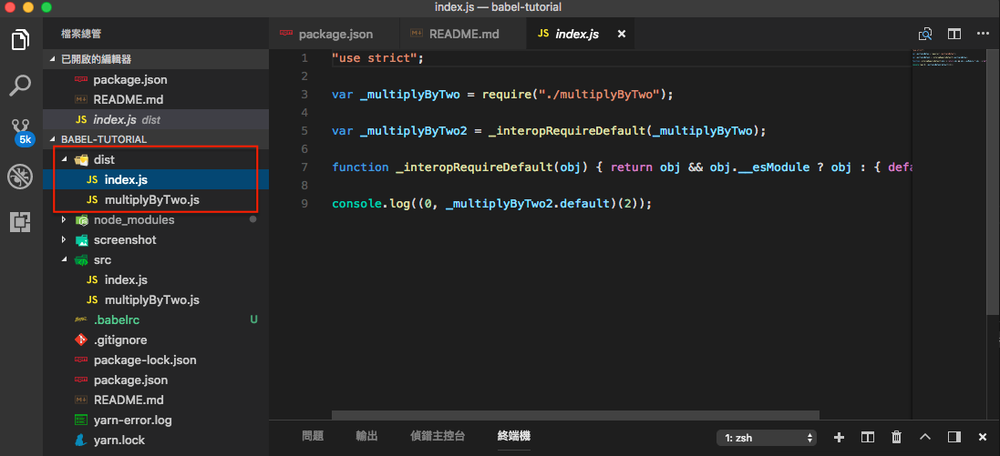

雖然 ES6 出了一陣子了但各家瀏覽器所支援的程度都不一所以目前還是要用 Babel 來轉譯成 ES5 語法，簡單來說 Babel 的作用就是將你的程式轉換為瀏覽器所看的懂的語法。

不過今天重點擺在於 Node.js 中的引入模組，以前我們都使用 `require` 與 `module.exports` 來做檔案的引入和匯出，ES6 的出現則有了 `import` 和 `export` 的模組，可惜的是 Node.js 目前尚未支援模組必須要用 Babel 轉譯成原生模組才能編譯執行。

## CommonJS
在開始進入主題前先來介紹何謂 CommonJS 以及我們原生在 Node.js 中引入外部檔案的方式
  - 是一個JavaScript模塊化的規範
  - CommonJS 所定義的規範是以同步的方式一個一個檔案的載入方式，確保所有相依模組的檔案都載入後才執行。
  - 目前 Node.js 採用 CommonJS 規範


```js
// index.js
const multiplyByTwo = require("./src/multiplyByTwo");
console.log(multiplyByTwo(2));
```

```js
// multiplyByTwo.js
const multiplyByTwo = (numberToMultipy) =>{
    return numberToMultipy*2;
}
module.exports = multiplyByTwo;
```

### 使用 Import, Export 模組
這邊將上面程式碼改成 ES6 的 Import 和 Export。

```js
// index.js

import multiplyByTwo from "./multiplyByTwo";
console.log(multiplyByTwo(2));
```


```js
// multiplyByTwo.js

const multiplyByTwo = (numberToMultipy) => {
  return numberToMultipy * 2;
}
export default multiplyByTwo;
```

執行 `index.js` 後你會發現報錯，錯誤訊息提到 `SyntaxError: Unexpected token import`。




## 救星 Bable 
這邊就來使用 Babel 將我們的 ES6 -> ES5

### 安裝
`babel-cli`  裡面包含 babel-node 命令，可以直接編譯運行 ES6 語法。這邊先用 `babel-preset-env` 不過官方最近已經合併釋出 `@babel/preset-env`，之後再來做新的教學講解這部分。 

```bash
$ npm install babel-cli babel-preset-env --save-dev
```

### 建立 .babelrc

```
{
  "presets": [
    "env"
  ]
}
```

### 執行編譯
這邊使用 `npx` ，使用 `npx` 省去了輸入 babel-node 完整路徑的麻煩。

```bash
npx babel-node src/index.js 
``` 

```bash
$ ./node_modules/.bin/babel-node src/index.js
```



### nodemon 監聽文件
這邊可以使用 nodemon 來監聽程式法是否有變動，若監聽到變動則自動 Babel 重新編譯。


這遍建議開發者將 nodemon 安裝在全域。
```bash
$ npm install -g nodemon
```

```bash
$ nodemon src/index.js --exec babel-node
```



### Babel 編譯並產出文件
使已使用指令將原本程式碼編譯並產出資料夾文件，執行後你可以去 dist 資料夾看轉譯後的結果。

```bash
npx babel src --out-dir dist
```





範例程式碼：https://github.com/1010code/babel-tutorial
